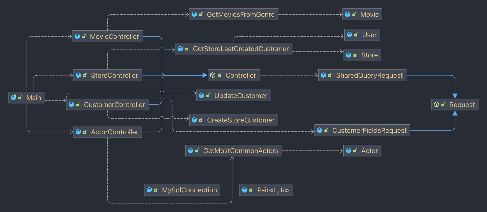

# Sakila & JBDC

<!-- TOC -->
* [Introduction](#introduction)
* [Set up](#set-up)
  * [Docker](#docker)
  * [CLI](#cli)
* [Execution](#execution)
  * [Other](#other)
  * [Execution examples](#execution-examples)
    * [`actor` command](#actor-command)
    * [`genre` command](#genre-command)
    * [`customer` command](#customer-command)
    * [`store` command](#store-command)
<!-- TOC -->

## Introduction

The goal of this small project was to develop a tool that would allow the user
to interact with a database that is running in docker.

## Set up

### Docker

You can create the containers using the following make comands:

```sh
# start the containers
make init

# load the sakila database
make load-sakila-db
```

### CLI

First of all, the CLI is expected to be run using Java11. Make sure that you
have Java installed in your system:

```sh
# use the following command to validate the installation
java --version
```

Finally, in case you have modified any of the docker configuration so that the
container runs with different user or password, make sure that the configuration
in the [`MySqlConnection`](./src/main/java/org/mddg/MySqlConnection.java) is
correct. Otherwise, update it as wanted.

## Execution

The executable is in the `target/` folder, named as `run.jar`. In order to
execute the application, in your terminal run:

```sh
java -jar target/run.jar ...
# you can create a temporal alias using 
# alias run_app="java -jar target/run.jar"
```

The application has the following commands:

```sh
# you can find them by executing the command without using any comand
actor       Find actors that have made the most movies
genre       Find movies of the given genre
customer
  create    Creates a new customer for a given store
  update    Updates an existing customer info
store       Finds last created customers for each store
```

Here's an explanation of the commands

- The `actor` command allows the user to get the list of actors that have
  appeared in most amount of movies. 
    - You can pass the `--limit` (`-l`) argument to explicitly say how many
      actors do you want as the output.
    - You can pass the `--order` (`-o`) argument to explicitly say the order of
      the actors (accepts ASC and DESC).
- The `genre` command allows the user to get the movies that are tagged with the
  genre specified.
    - You can pass the `--limit` (`-l`) argument to explicitly say how many
      movies do you want as the output.
    - You can pass the `--order` (`-o`) argument to explicitly say the order of
      the movies (accepts ASC and DESC).
- The `customer` command has two nested commands: `create` and `update`. The
  `create` command allows the user to create a new customer, while the `update`
  allows the user to create a new customer.
    - You need to/can pass the `--first-name` (`-f`) to insert/update the first
      name of the customer.
    - You need to/can pass the `--last-name` (`-l`) to insert/update the last
      name of the customer.
    - You can pass the `--email` (`-e`) to insert/update the email of the customer.
    - You need to/can pass the `--address-id` (`-a`) to insert/update the address of
      the customer.
    - You need to/can pass the `--store-id` (`-s`) to insert/update the store id
      name of the customer.
    - When updating a user, you will need to specify the `id` (`--id` or `-i`)
      to know which user to update.
- The `store` command allows the user to get the last created users for each
  store.
    - You can pass the `--order` (`-o`) argument to explicitly say the order of
      the movies (accepts ASC and DESC).

### Other

The structure of the application is really simple and straighforward. The class
diagram is as follows:



### Execution examples

#### `actor` command

```sh
$ java -jar target/run.jar actor
# ... returns long list of actors

$ java -jar target/run.jar actor --limit=10 --order=DESC
GINA DEGENERES (42)
WALTER TORN (41)
MARY KEITEL (40)
MATTHEW CARREY (39)
SANDRA KILMER (37)
SCARLETT DAMON (36)
VAL BOLGER (35)
VIVIEN BASINGER (35)
GROUCHO DUNST (35)
UMA WOOD (35)

$ java -jar target/run.jar actor --limit=5 --order=ASC
JUDY DEAN (15)
JULIA FAWCETT (15)
JULIA ZELLWEGER (16)
SISSY SOBIESKI (18)
```

#### `genre` command

```sh
$ java -jar target/run.jar genre Comedy
# ... returns long list of movies

$ java -jar target/run.jar actor --limit=10 --order=DESC
Movies found for genre: Comedy
ZORRO ARK
WISDOM WORKER
VERTIGO NORTHWEST
VELVET TERMINATOR
VALLEY PACKER
TRAMP OTHERS
TRAINSPOTTING STRANGERS
SWEDEN SHINING
SUBMARINE BED
STRICTLY SCARFACE

$ java -jar target/run.jar actor --limit=5 --order=ASC
Movies found for genre: Comedy
AIRPLANE SIERRA
ANTHEM LUKE
BRINGING HYSTERICAL
CAPER MOTIONS
CAT CONEHEADS
```

#### `customer` command

Insertion of customers:

```sh
$ java -jar target/run customer insert -f=Miquel -l="de Domingo" \
-e="miquel.dedomingo@salle.students.url.edu" -a=1 -s=1
Customer inserted successfully {id:607} # ids will differ

$ java -jar target/run customer insert -f=Miquel -l="de Domingo" -a=1 -s=1
Customer inserted successfully {id:608} # ids will differ
```

Updation of customers:

```sh
$ java -jar target/run customer update --id=607 -f="Leuqim" 
Customer updated successfully
```

#### `store` command

```sh
$ java -jar target/run.jar store
Last created customers for stores
Store: 1 -> Miquel de Domingo (no-email) [2023-01-15]
Store: 2 -> AUSTIN CINTRON (AUSTIN.CINTRON@sakilacustomer.org) [2006-02-14]

$ java -jar target/run.jar store --order=DESC
Last created customers for stores
Store: 1 -> Miquel de Domingo (no-email) [2023-01-15]
Store: 2 -> AUSTIN CINTRON (AUSTIN.CINTRON@sakilacustomer.org) [2006-02-14]

$ java -jar target/run.jar store --order=ASC
First created customers for stores
Store: 1 -> Miquel de dede Domingo (MARY.SMITH@sakilacustomer.org) [2006-02-14]
Store: 2 -> BARBARA JONES (BARBARA.JONES@sakilacustomer.org) [2006-02-14]
```
