# Selenium Exercise

Author: Miquel de Domingo i Giralt  
Email: miquel.dedomingo@students.salle.url

## Images

Here are the images of the process, that show each step of hte test:

1. The vueling page is opened:

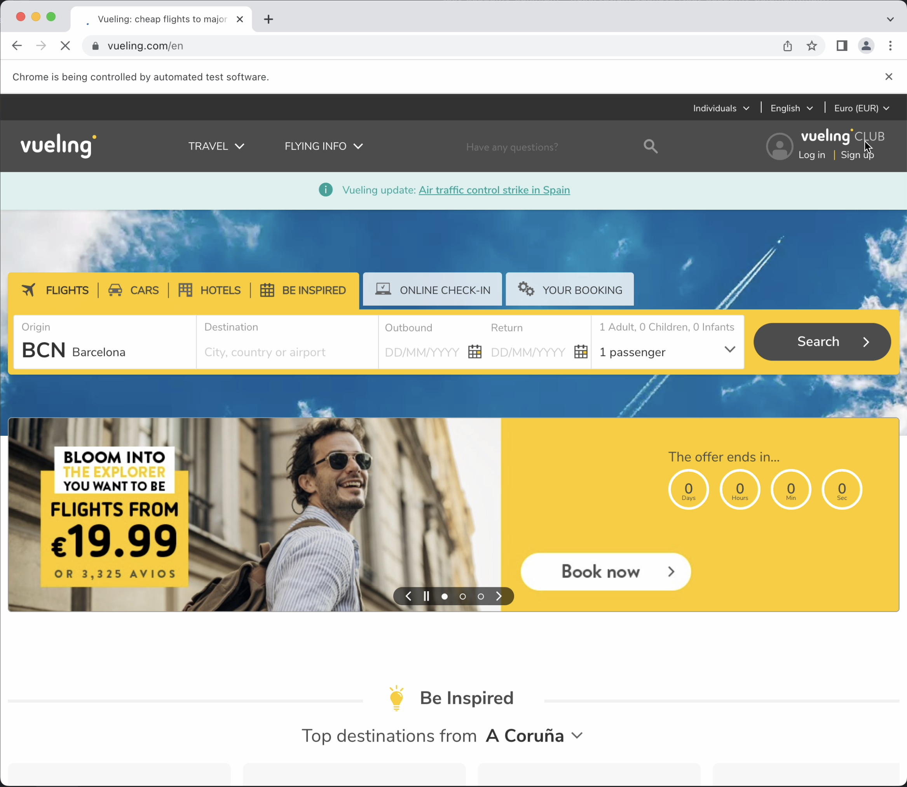

2. Cookies pop-up appear, need to be accepted:

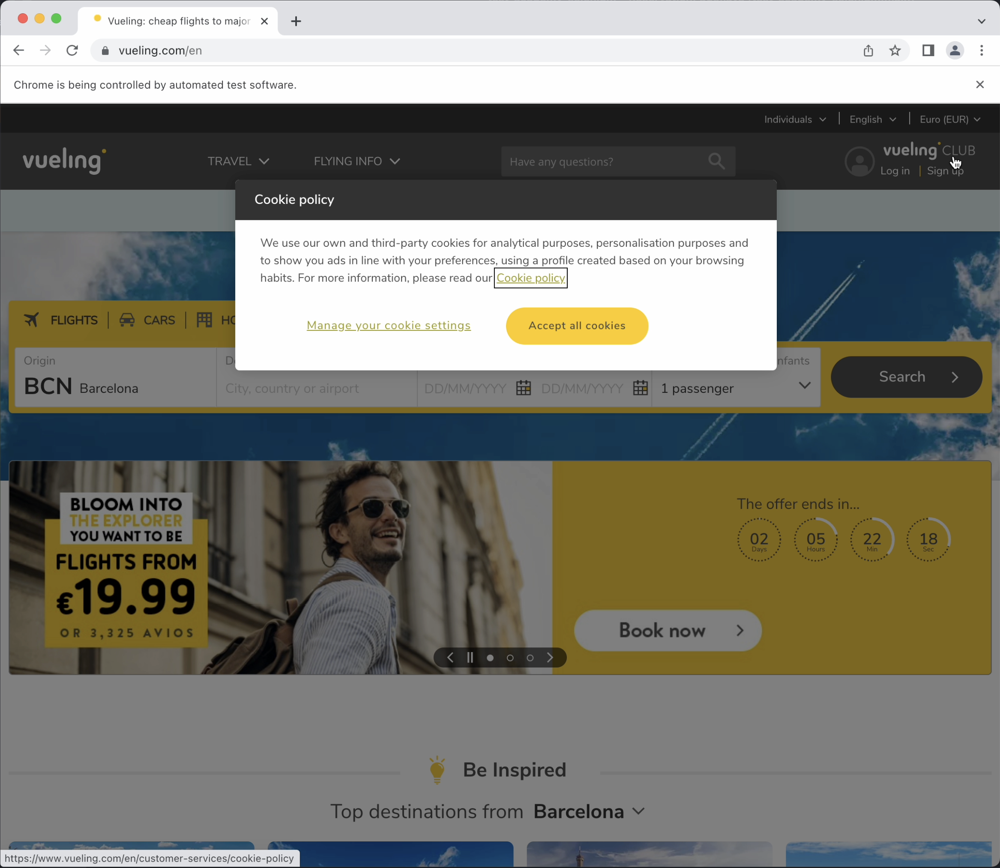

3. Main page again without the cookies:

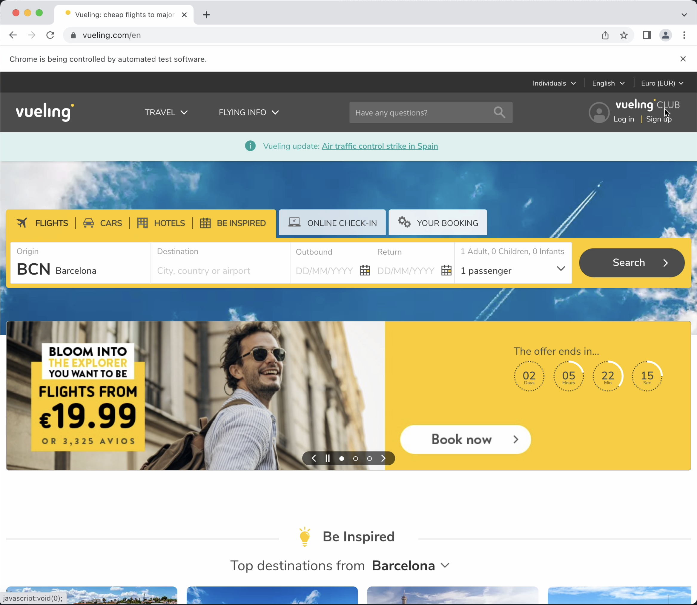

4. Origin input is clicked, which opens a pop-up:

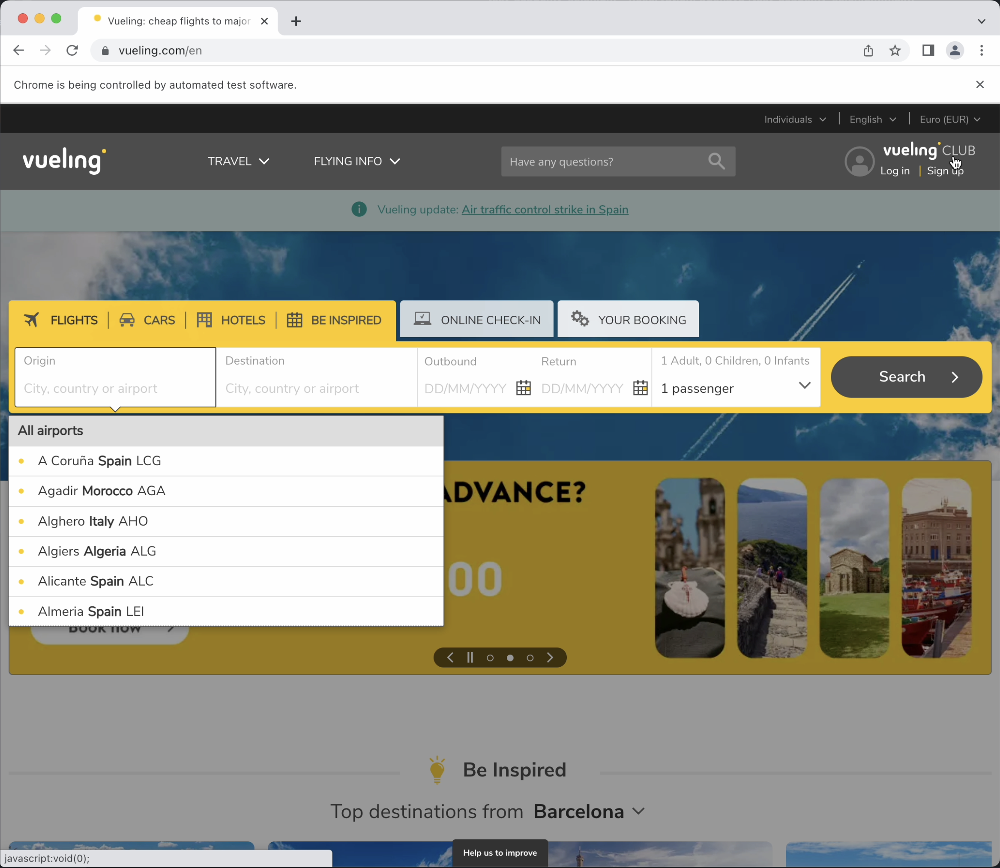

5. Barcelona is selected as the origin:

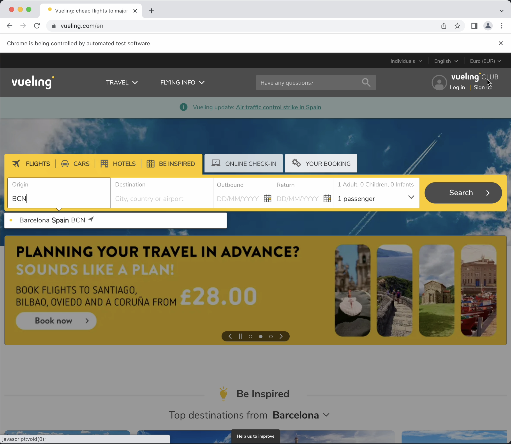

6. Destination input is clicked, which opens a pop-up:

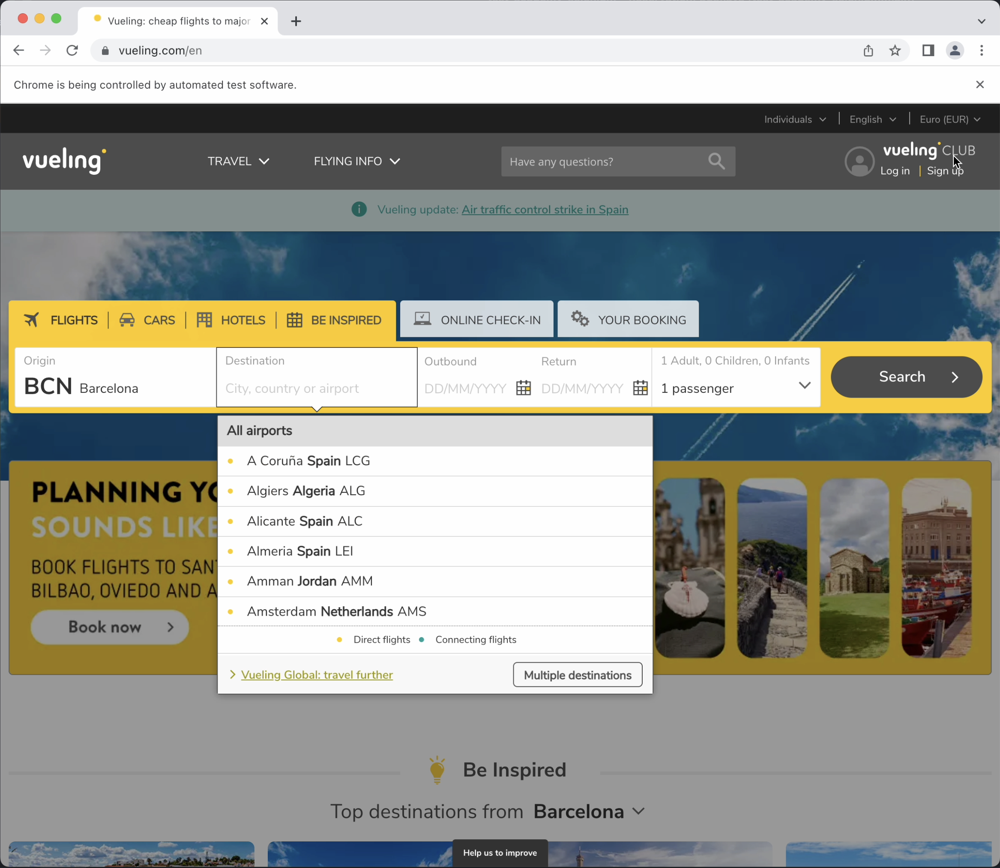

7. Madrid is selected as the origin:

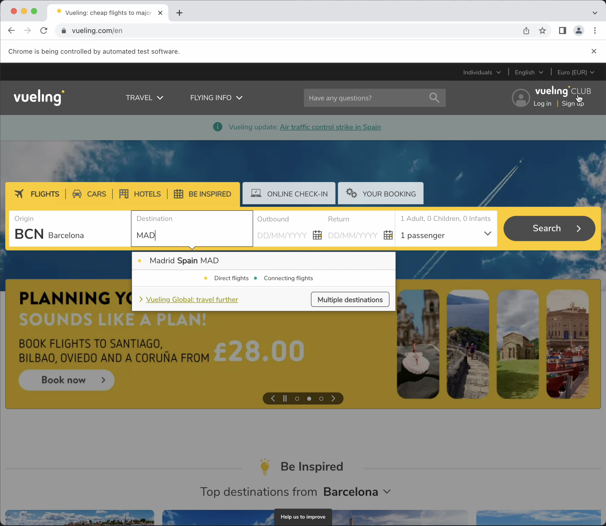

8. Outbound date input is clicked, which opens a pop-up:
 
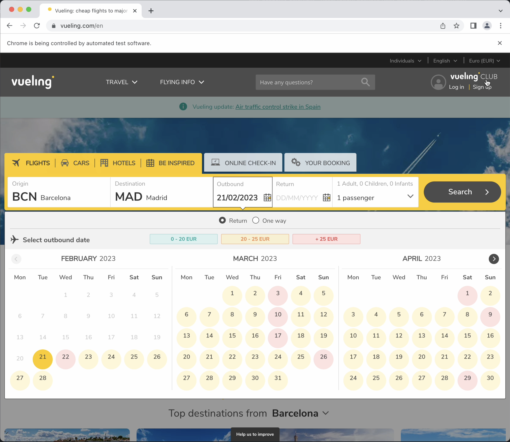

9. First of june is selected, as a one way trip:

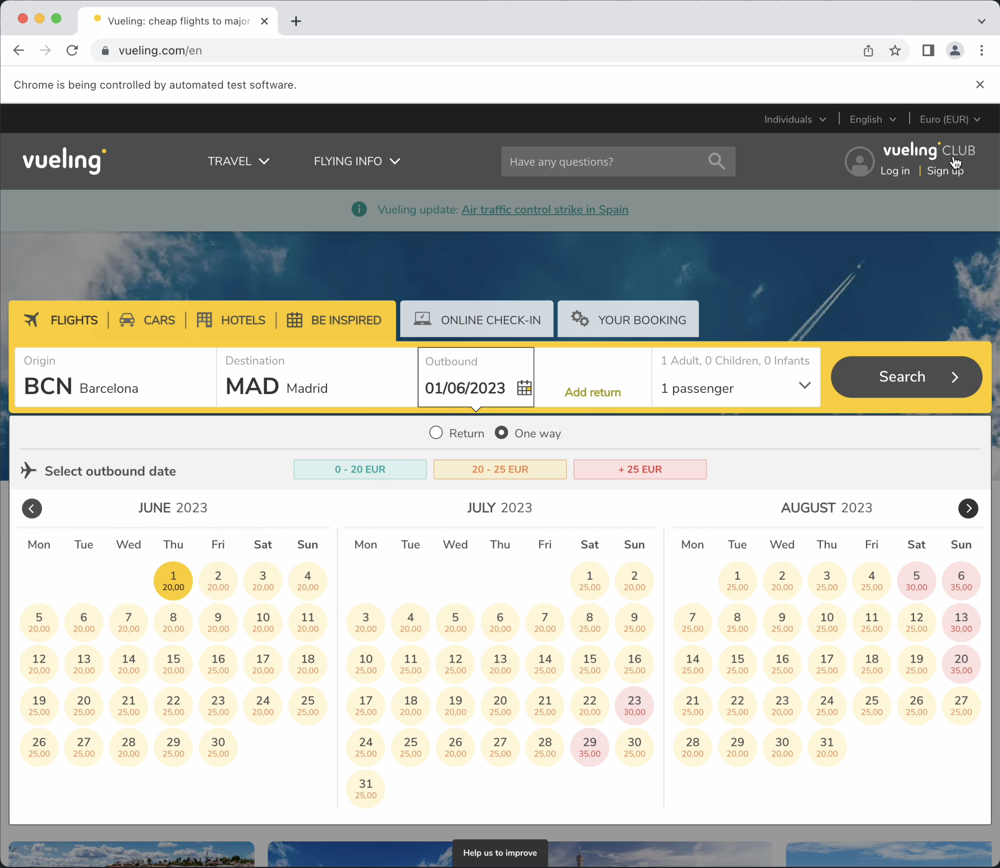

10. Trip has been submitted and is now searching for flights: 

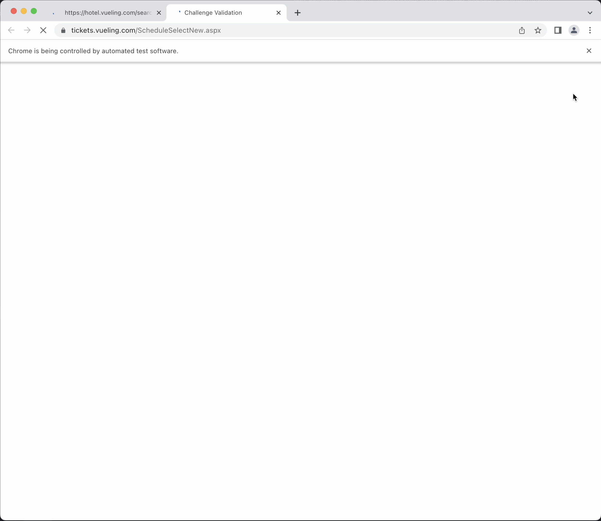

11. Trip has been submitted and is now searching for flights:

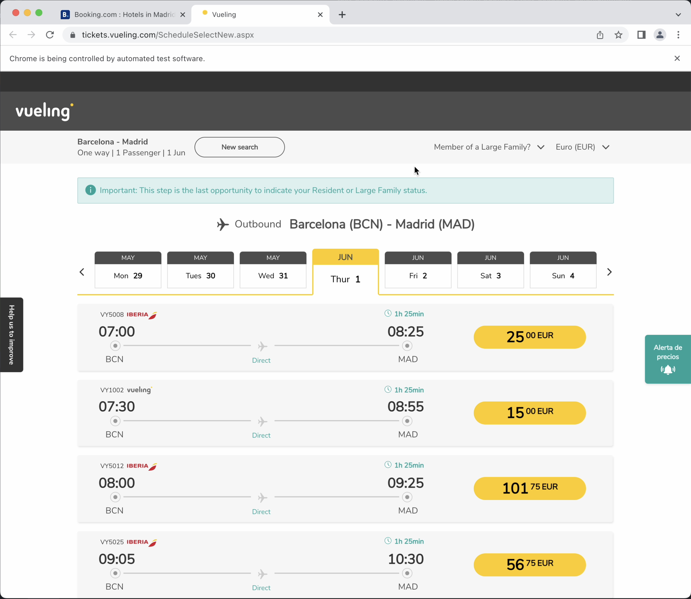
